# RQ1 - All Figures and Outputs

This file consolidates all generated RQ1 figures and output artifacts in one place.

## Figures (Embedded)

### rq1_fig1_entropy_by_perturbation_type_clean.png
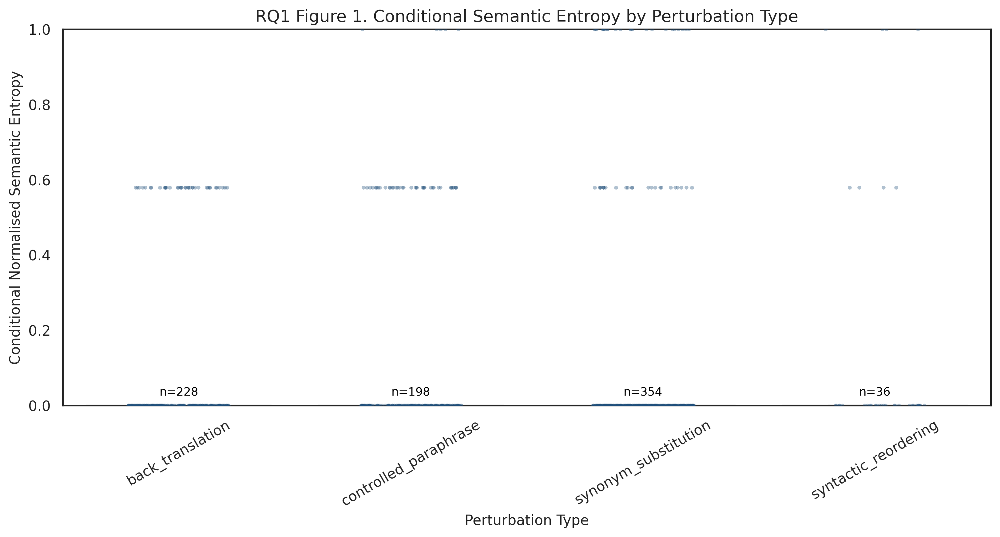

### rq1_fig1_entropy_by_perturbation_type.png
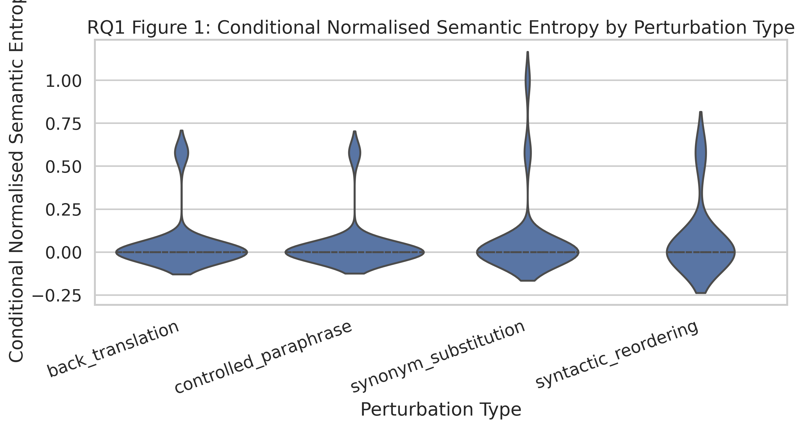

### rq1_fig2_mean_entropy_by_linguistic_category_clean.png
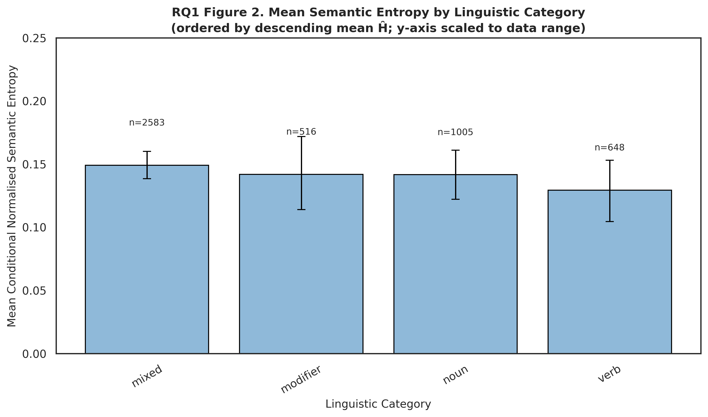

### rq1_fig2_entropy_by_linguistic_category.png
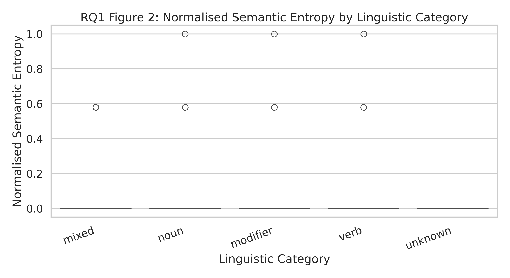

### rq1_fig3_lexical_change_vs_entropy_clean.png
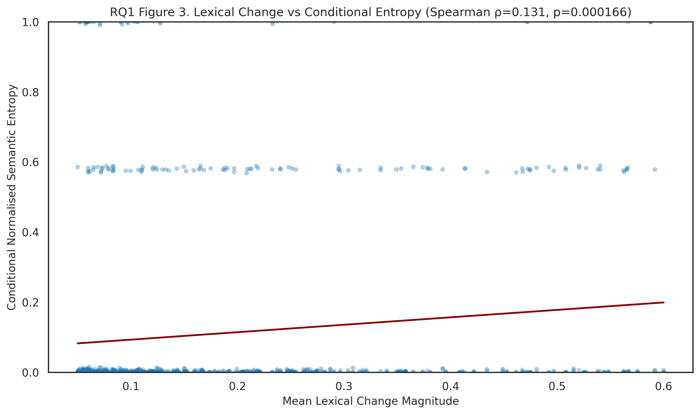

### rq1_fig3_lexical_change_vs_entropy.png
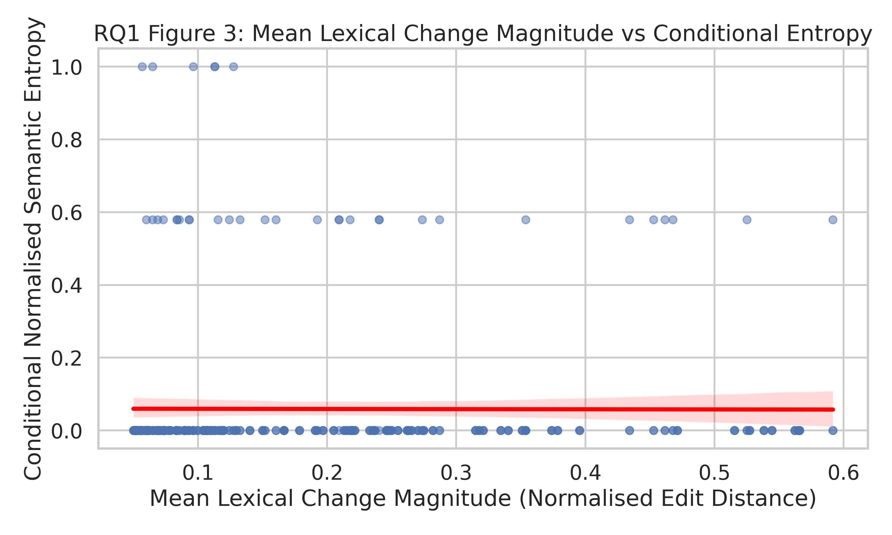

### rq1_fig4_interaction_clean.png
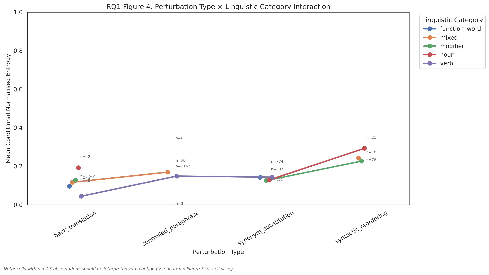

### rq1_fig4_interaction_plot.png
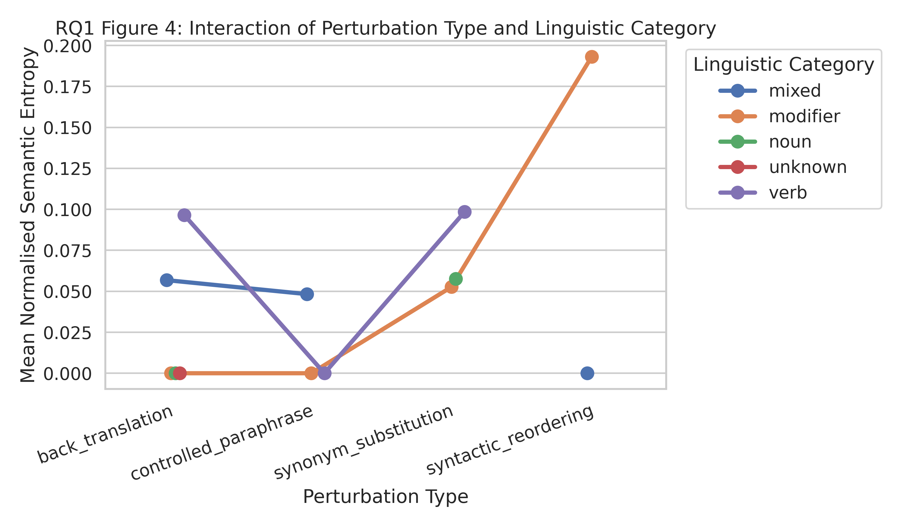

### rq1_fig5_entropy_heatmap_clean.png
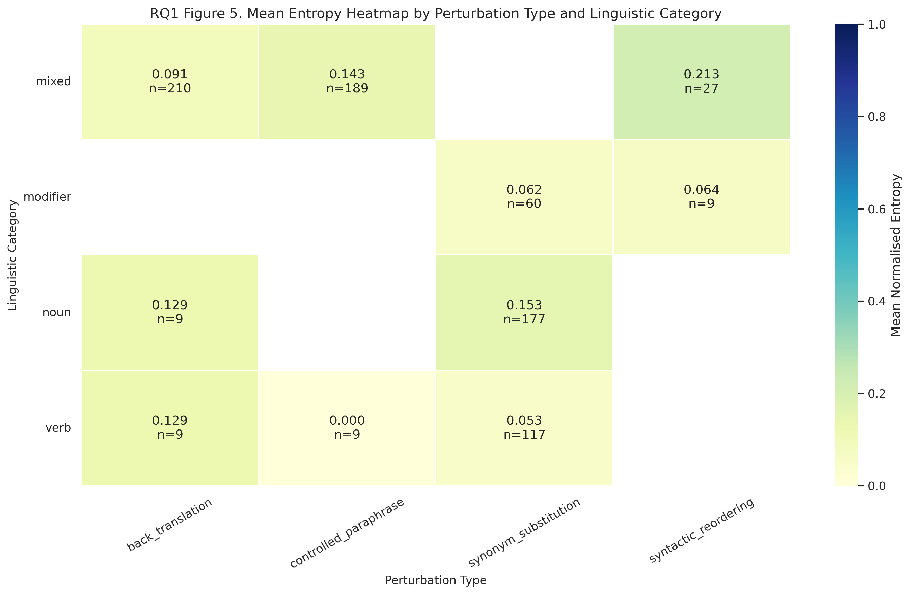

### rq1_fig5_entropy_heatmap.png
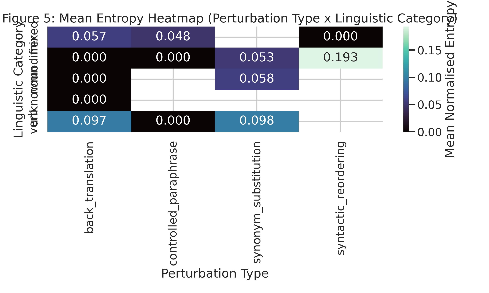

### rq1_fig6_model_comparison_clean.png
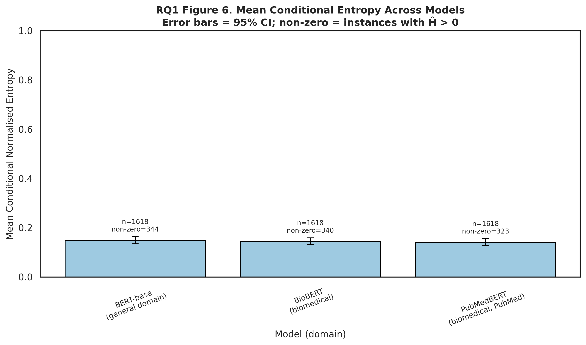

### rq1_fig6_model_comparison.png
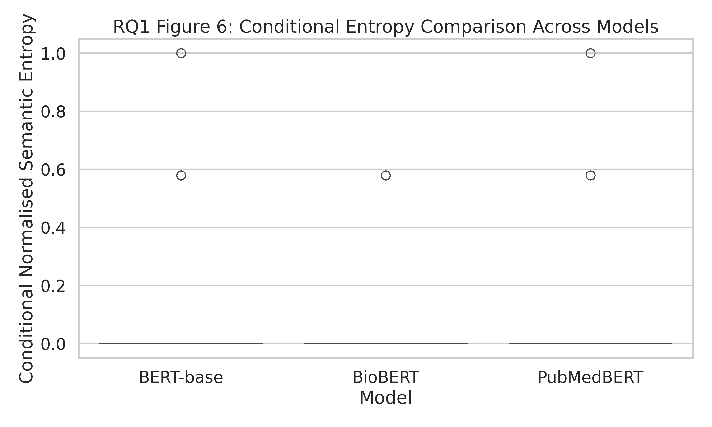

### rq1_figure1_entropy_by_perturbation_type.png
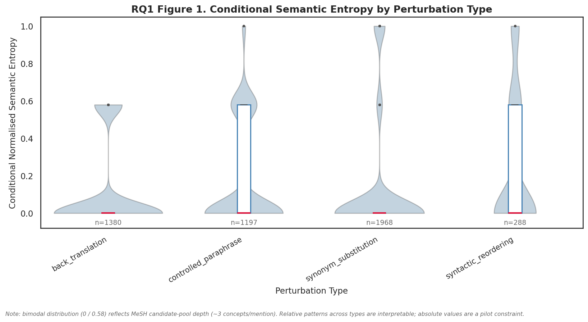

### rq1_figure3_lexical_change_vs_entropy.png
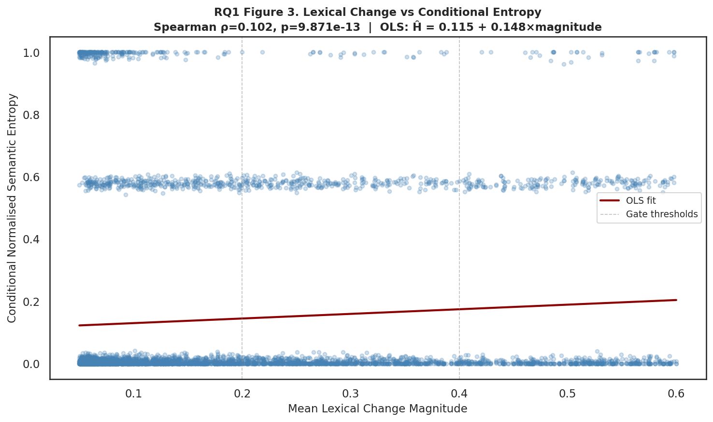

### rq1_figure5_entropy_heatmap.png
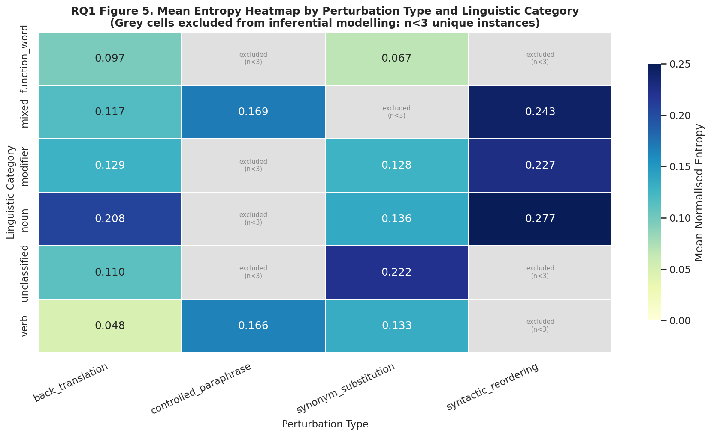

## Figure Files (All PNG/PDF)

- `outputs/rq1/figures/rq1_fig1_entropy_by_perturbation_type_clean.pdf`
- `outputs/rq1/figures/rq1_fig1_entropy_by_perturbation_type_clean.png`
- `outputs/rq1/figures/rq1_fig1_entropy_by_perturbation_type.pdf`
- `outputs/rq1/figures/rq1_fig1_entropy_by_perturbation_type.png`
- `outputs/rq1/figures/rq1_fig2_entropy_by_linguistic_category.pdf`
- `outputs/rq1/figures/rq1_fig2_entropy_by_linguistic_category.png`
- `outputs/rq1/figures/rq1_fig2_mean_entropy_by_linguistic_category_clean.pdf`
- `outputs/rq1/figures/rq1_fig2_mean_entropy_by_linguistic_category_clean.png`
- `outputs/rq1/figures/rq1_fig3_lexical_change_vs_entropy_clean.pdf`
- `outputs/rq1/figures/rq1_fig3_lexical_change_vs_entropy_clean.png`
- `outputs/rq1/figures/rq1_fig3_lexical_change_vs_entropy.pdf`
- `outputs/rq1/figures/rq1_fig3_lexical_change_vs_entropy.png`
- `outputs/rq1/figures/rq1_fig4_interaction_clean.pdf`
- `outputs/rq1/figures/rq1_fig4_interaction_clean.png`
- `outputs/rq1/figures/rq1_fig4_interaction_plot.pdf`
- `outputs/rq1/figures/rq1_fig4_interaction_plot.png`
- `outputs/rq1/figures/rq1_fig5_entropy_heatmap_clean.pdf`
- `outputs/rq1/figures/rq1_fig5_entropy_heatmap_clean.png`
- `outputs/rq1/figures/rq1_fig5_entropy_heatmap.pdf`
- `outputs/rq1/figures/rq1_fig5_entropy_heatmap.png`
- `outputs/rq1/figures/rq1_fig6_model_comparison_clean.pdf`
- `outputs/rq1/figures/rq1_fig6_model_comparison_clean.png`
- `outputs/rq1/figures/rq1_fig6_model_comparison.pdf`
- `outputs/rq1/figures/rq1_fig6_model_comparison.png`
- `outputs/rq1/figures/rq1_figure1_entropy_by_perturbation_type.png`
- `outputs/rq1/figures/rq1_figure3_lexical_change_vs_entropy.png`
- `outputs/rq1/figures/rq1_figure5_entropy_heatmap.png`

## Output Tables

- `outputs/rq1/tables/rq1_accepted_perturbation_type_counts.csv`
- `outputs/rq1/tables/rq1_conditional_entropy_scores.csv`
- `outputs/rq1/tables/rq1_entropy_scores.csv`
- `outputs/rq1/tables/rq1_figure_group_summary.csv`
- `outputs/rq1/tables/rq1_gate_rejection_summary.csv`
- `outputs/rq1/tables/rq1_group_comparisons.csv`
- `outputs/rq1/tables/rq1_interaction_summary.csv`
- `outputs/rq1/tables/rq1_mixed_effects_results.csv`
- `outputs/rq1/tables/rq1_perturbation_diagnostics_by_type.csv`
- `outputs/rq1/tables/rq1_predictor_importance.csv`
- `outputs/rq1/tables/rq1_r2_summary.csv`
- `outputs/rq1/tables/rq1_semantic_shift_glm_results.csv`

## Intermediate Files

- `outputs/rq1/intermediate/rq1_linguistic_features.csv`
- `outputs/rq1/intermediate/rq1_model_outputs.csv`
- `outputs/rq1/intermediate/rq1_sampled_instances.csv`
- `outputs/rq1/intermediate/rq1_validated_perturbations.csv`
- `outputs/rq1/intermediate/umls_candidate_pool.csv`

## Other RQ1 Outputs

- `outputs/rq1/rq1_results_summary_for_paper.txt`
- `outputs/rq1/rq1_run_metadata.json`
